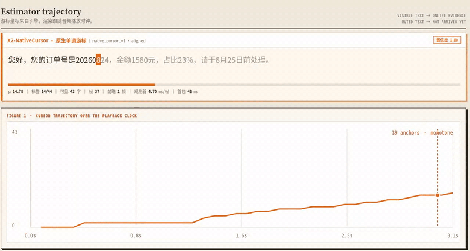
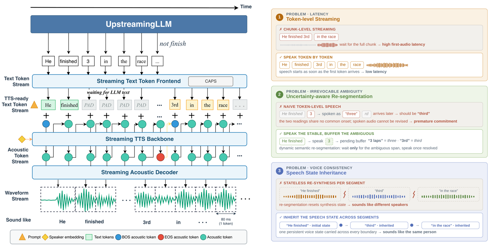
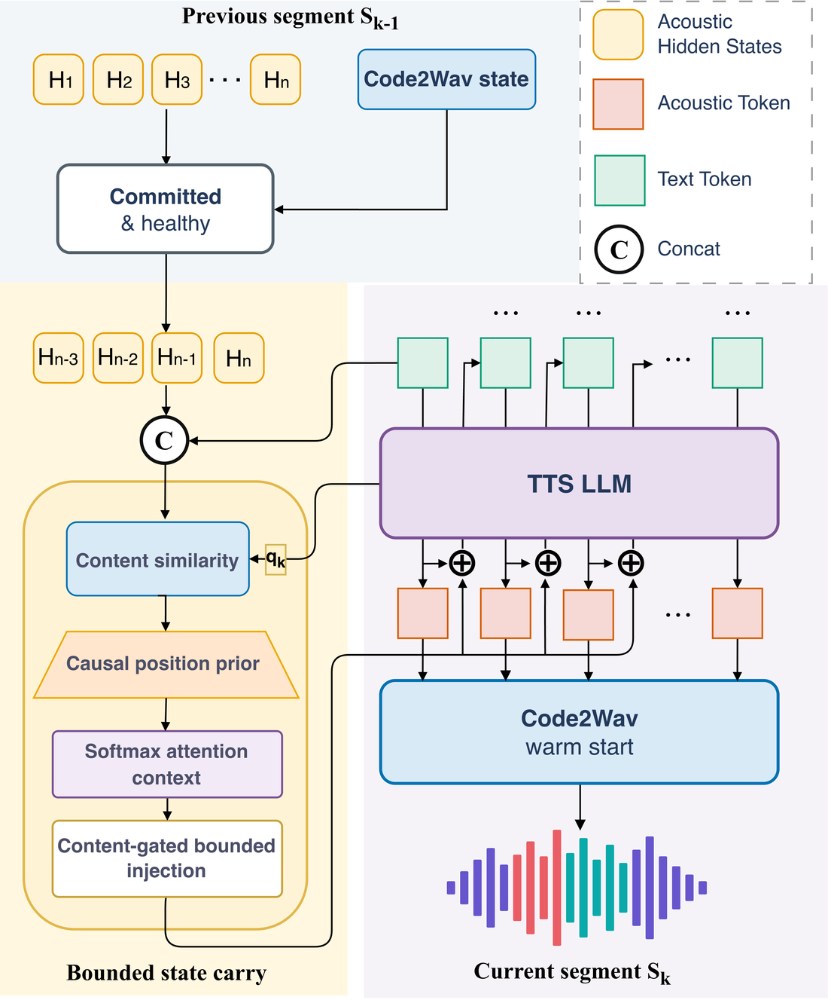
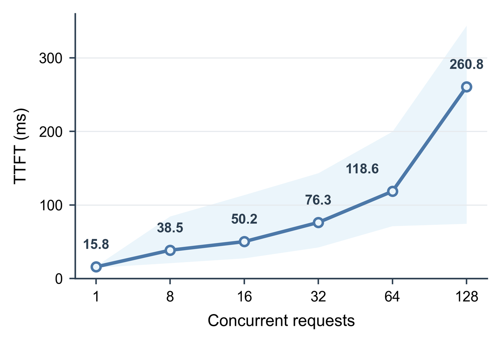
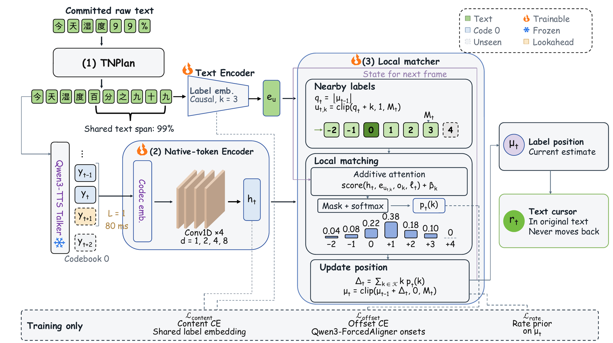
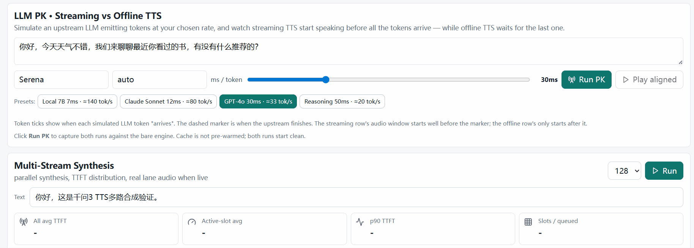

<div align="center">
  <h1>
    
    X2Streaming-TTS
  </h1>
  <p>
    <strong>Causal token-level text-to-speech from streaming text</strong><br>
    Speak while the language model is still writing, without ever taking a word back.
  </p>
  <p>
    <a href="https://arxiv.org/abs/2608.18661"></a>
    <a href="https://huggingface.co/x-square-robot/X2Streaming-TTS-1.7B"></a>
    <a href="https://huggingface.co/x-square-robot/X2-NativeCursor-Qwen3TTS-12Hz"></a>
    <a href="https://github.com/X-Square-Robot/X2Streaming-TTS/actions/workflows/ci.yml"></a>
    
    <a href="LICENSE"></a>
    <a href="https://github.com/X-Square-Robot/Qwen3TTS-Streaming"></a>
    <a href="https://github.com/X-Square-Robot/X2-Turn"></a>
  </p>
</div>

**English** | [简体中文](README.zh-CN.md)

X2Streaming-TTS is the reference implementation of
[*X2Streaming-TTS: Causal Token-Level Text-to-Speech from Streaming Text with
Speech-State Inheritance*](https://arxiv.org/abs/2608.18661). The paper introduces two
mechanisms: **causal commitment**, which decides which text may be spoken and where a
segment closes, and **causal speech-state inheritance**, which lets the next segment
continue the voice of the previous one.

The method runs on [Qwen3TTS-Streaming](https://github.com/X-Square-Robot/Qwen3TTS-Streaming),
X Square Robot's own inference-engine project. That engine exports the official
Qwen3-TTS weights to ONNX/TensorRT and provides the scheduler, continuous batching,
protocol, gateways and deployment tooling; this README calls it the upstream engine.
X2Streaming-TTS is the method layer on top of it: this repository holds the method code
and the hooks that connect it to the engine, and references the engine itself as a git
submodule at commit `0745e4a8`.

## 🔥 News

- **[2026-09-07] X2-NativeCursor: reading progress read from the generator's own tokens.**
  Streaming TTS starts speaking before the sentence is finished, so a client receives
  audio without knowing which characters it carries. A 2M-parameter observer reads the
  codebook-0 token the Talker emits every 80 ms and publishes a cursor into the source
  text that never moves backward. The generator, tokenizer and vocoder stay as they
  are; the observer is the only addition. It ships in the upstream engine behind `text_progress.estimator: native`; see
  [X2-NativeCursor](#x2-nativecursor-reading-progress-from-native-tokens) below and the
  [feature page](docs/native_cursor.md).
- **[2026-09-07] Weights released.** The deployed checkpoint
  [`x-square-robot/X2Streaming-TTS-1.7B`](https://huggingface.co/x-square-robot/X2Streaming-TTS-1.7B)
  and the X2-NativeCursor observer head
  [`x-square-robot/X2-NativeCursor-Qwen3TTS-12Hz`](https://huggingface.co/x-square-robot/X2-NativeCursor-Qwen3TTS-12Hz)
  are on Hugging Face under Apache-2.0. See [Models](#models).
- **[2026-08-19]** The paper is on arXiv: [2608.18661](https://arxiv.org/abs/2608.18661).
- **[2026-08-06]** First public release of the method code, against Qwen3TTS-Streaming
  commit `0745e4a8`.

<div align="center">
  
  <p><em>X2-NativeCursor on a live engine. Every highlight step and every point on the trajectory comes from a live <code>text_progress</code> anchor emitted by the engine. <code>23%</code> is spoken 百分之二十三, the percent sign before the digits, and the cursor still advances in written order. Full clip with the session's own audio: <a href="docs/assets/native_cursor_lab.mp4">native_cursor_lab.mp4</a>.</em></p>
</div>

## Models

| Repository | Contents | Size | License |
| --- | --- | --: | --- |
| [`x-square-robot/X2Streaming-TTS-1.7B`](https://huggingface.co/x-square-robot/X2Streaming-TTS-1.7B) | CustomVoice model fine-tuned from Qwen3-TTS-12Hz-1.7B-Base, speaker `robot_service_v1`, Hugging Face format (safetensors + 12 Hz speech tokenizer); the upstream engine exports it to TensorRT as the `custom-1.7b` variant | 4.3 GB | Apache-2.0 |
| [`x-square-robot/X2-NativeCursor-Qwen3TTS-12Hz`](https://huggingface.co/x-square-robot/X2-NativeCursor-Qwen3TTS-12Hz) | Reading-progress observer head, 2.0M parameters, reads the codebook-0 tokens of the model above; drop it into the engine's `resources/native_cursor/` to enable | 8.2 MB | Apache-2.0 |

Each model card lists the files, SHA-256 checksums, usage and scope.

## Table of contents

- [Models](#models)
- [Why token-level streaming is hard](#why-token-level-streaming-is-hard)
- [What X2Streaming-TTS does](#what-x2streaming-tts-does)
- [Results](#results)
- [X2-NativeCursor: reading progress from native tokens](#x2-nativecursor-reading-progress-from-native-tokens)
- [Demo](#demo)
- [Getting started](#getting-started)
- [Paper mapping](#paper-mapping)
- [Repository layout](#repository-layout)
- [Status and limitations](#status-and-limitations)
- [Related projects](#related-projects)
- [Citation](#citation)
- [Acknowledgments](#acknowledgments)
- [License](#license)

## Why token-level streaming is hard

Once speech is played, it cannot be revised. When an upstream language model writes
`He finished 3`, the next token decides whether `3` is read *three* (`3 laps`) or
*third* (`3rd`). A system that has already said *three* cannot take it back. Most
"streaming" TTS systems avoid the problem by waiting for a whole sentence, which makes
them pseudo-streaming: their first audio is tied to how fast the language model finishes
the sentence.

True token-level synthesis has to make **irreversible commitments under partial
observability**. Three things that are trivial offline become hard:

| Requirement | What goes wrong in a naive token-level system |
| --- | --- |
| **Pronunciation** | Numbers, units and symbols get voiced before the characters that decide their reading arrive. |
| **Breathing room** | Punctuation-only cuts produce many short segments that burn the generation budget on stop-and-restart; fixed windows cut at positions unrelated to the language. |
| **Continuation** | A segment that starts from silence has to rebuild pitch and timbre from scratch, so the seam between segments is audible. |

<div align="center">
  
  <p><em>Figure 1 of the paper. Left: the frontend releases only TTS-ready text (PAD when nothing is ready), the Talker emits acoustic tokens, and Code2Wav streams waveform for immediate playback. Right: the three challenges and the mechanism that answers each.</em></p>
</div>

## What X2Streaming-TTS does

The system consumes asynchronously arriving text tokens and emits speech **without
accessing future input**. Zero lookahead is affordable because text is
information-dense while speech is temporally redundant: voicing the text that has
already arrived buys time for the next tokens. Two mechanisms make that safe.

### Causal commitment: decide what may be spoken, and when to close a segment

- **Uncertainty-aware semantic readiness** keeps an expression provisional while a
  future token could still change its reading. `3` in `He finished 3` waits; once
  `3rd` or `3 laps` arrives the whole span is normalized and released atomically, and it
  is never revised afterwards.
- **Capacity-adaptive, punctuation-aware segmentation** closes the active segment
  before the acoustic budget runs out. It keeps an online estimate of how many acoustic
  steps each text token costs, tiers punctuation (sentence-final, clause-level, weaker
  marks) and only falls back to a hard cut when no linguistic boundary shows up in time.
  The paper proves a bound on how many extra segments this can create.

### Causal speech-state inheritance: continue the voice across the boundary

- The **complete Code2Wav state** (KV cache, convolution states, frame index) warm-starts
  the next segment's waveform decoding.
- The **trailing `H = 4` Talker states** provide bounded historical context through a
  fixed causal attention prior that assigns zero weight to future positions and a
  residual whose gain is explicitly bounded.
- A **health check** keeps both paths alive only when the previous segment ended
  normally; otherwise generation restarts from the default state.

<div align="center">
  
  <p><em>Figure 2 of the paper. After a health check on the previous segment, its Code2Wav state warm-starts the next one, while its trailing Talker states provide bounded context through causal-prior attention and a gated residual.</em></p>
</div>

### Highlights

- **Strictly causal.** An acoustic token depends only on text observed before it was
  generated, previously generated acoustic tokens and inherited state.
- **Quality on par with offline decoding of the same weights.** Lower recognition error
  than the offline reference in 3 of 8 conditions; the largest degradation elsewhere is
  0.62 percentage points.
- **Boundaries you cannot hear.** Pitch discontinuity at segment boundaries drops to
  22.61 Hz, against 31.68 Hz for the best chunk-level comparator.
- **Symbols read right.** On symbol-heavy text the character error rate is 2.00% with
  73.3% fully correct readings, against 6.65% and 40.0% for the strongest comparator.
- **Fast first audio.** Median time to first audio token of 15.8 ms for a single request
  and 260.8 ms at 128 concurrent requests on one RTX 5090.
- **Built on an open engine.** Everything runs on Qwen3TTS-Streaming, so you inherit its
  TensorRT export, continuous batching, gateways and SDK.

## Results

All numbers are from the [paper](https://arxiv.org/abs/2608.18661) and use the
released defaults in `config.py`. Text tokens are supplied at a fixed rate for controlled
evaluation; a deployed language model may be burstier.

**Intelligibility and long-text robustness** (% error, lower is better). The first and
last rows share the same backbone and identical weights, so their difference is the cost
of strictly incremental input.

| Model | Streaming | Granularity | SEED zh CER | SEED en WER | MiniMax zh CER | MiniMax en WER | Long 1× | Long 2× | Long 5× | Long 10× |
| --- | :-: | :-: | --: | --: | --: | --: | --: | --: | --: | --: |
| Qwen3-TTS-12Hz-1.7B | ✗ | offline | 1.10 | 1.43 | 0.87 | 1.85 | 3.95 | 3.05 | 4.01 | 3.93 |
| F5-TTS | ✗ | offline | 1.52 | 2.00 | 3.74 | 2.08 | 4.42 | 3.81 | 5.04 | 4.95 |
| FireRedTTS-2 | ✓ | chunk | 1.14 | 1.95 | 0.97 | 2.25 | 5.36 | 4.79 | 5.04 | 5.32 |
| CosyVoice 2-S | ✓ | chunk | 1.45 | 2.57 | 1.98 | 2.38 | 4.76 | 3.83 | 5.05 | 5.48 |
| CosyVoice 3-S | ✓ | chunk | 0.81 | **1.68** | 1.43 | 2.21 | 4.72 | **3.36** | 4.86 | 5.12 |
| **X2Streaming-TTS** | ✓ | **token** | **0.78** | 1.93 | **0.78** | **1.86** | **2.55** | 3.67 | **4.08** | **4.36** |

**Boundary continuity and long-text stability** under fixed-rate token arrival
(954 shared boundaries in 59 passages; ECAPA and UTMOS on fixed 10 s windows).

| System | ΔF0 (Hz) ↓ | ΔE (dB) ↓ | PBD ↓ | ECAPA sim. ↑ | UTMOS ↑ |
| --- | --: | --: | --: | --: | --: |
| CosyVoice 2-S | 46.89 | 3.39 | 0.3427 | 0.9304 | 3.1949 |
| CosyVoice 3-S | 47.53 | 3.41 | 0.3479 | 0.9264 | 2.6899 |
| FireRedTTS-2 | 31.68 | 2.17 | 0.1915 | 0.5205 | 3.2704 |
| **X2Streaming-TTS** | **22.61** | **1.66** | **0.1092** | **0.9511** | **3.9200** |

**Symbols and prefix ambiguity** on identical inputs (120 listeners; *Read* = fully
correct reading, *Sem.* = meaning preserved).

| System | CER ↓ | Read ↑ | UTMOS ↑ | MOS ↑ | Sem. ↑ |
| --- | --: | --: | --: | --: | --: |
| CosyVoice 2-S | 33.41 | 0.0 | 3.075 | 3.220 | 0.00 |
| CosyVoice 3-S | 6.65 | 40.0 | 3.017 | 3.183 | 60.00 |
| FireRedTTS-2 | 18.21 | 13.3 | 2.788 | 3.629 | 6.67 |
| **X2Streaming-TTS** | **2.00** | **73.3** | **4.025** | **3.802** | **93.33** |

**Causal commitment** on 59 held-out passages: budget utilization rises from 11.77%
(punctuation only) to 76.93%, the hard-cap rate falls from 87.13% (fixed window) to
0.54%, and boundary quality against human annotations reaches F1 0.952, slightly above
SaT-3L (0.940), which reads up to 48 future subwords.

<div align="center">
  
  <p><em>Time to first audio token under concurrency on one RTX 5090 with the deployed BF16 engine. Points are client-side medians; the band spans the minimum to the 99th percentile. 20 measured rounds after 3 warm-up rounds per level.</em></p>
</div>

## X2-NativeCursor: reading progress from native tokens

Token-level streaming raises a second question the moment it works: **which characters
is the audio I just received carrying?** Highlighting, barge-in accounting, subtitle
timing and dialogue history all need that position, and a fixed audio-frames-per-token
ratio only approximates it. Running a waveform aligner recovers it, at the cost of a
second acoustic model per stream.

X2-NativeCursor answers the question **before waveform decoding**. Every 80 ms the
Talker emits one codebook-0 token; a lightweight observer reads it, scores it against
the spoken labels of the text visible so far and advances a continuous position. The
published cursor is the high-water mark of that position, projected back into the raw
text, so it never moves backward even when the spoken order differs from the written
order (`99%` → 百分之九十九). The generator, tokenizer and vocoder are untouched.

<div align="center">
  
  <p><em>Overview. (1) TNPlan maps spoken labels to original-text spans. (2) A native-token encoder and (3) a local matcher track the current label position before waveform decoding. Dashed paths are used only during training.</em></p>
</div>

| | Research evaluation | Engine acceptance |
| --- | --- | --- |
| Setup | Qwen3-TTS, 800 frozen test texts, text in 2–8 character chunks, reference = Qwen3-ForcedAligner | The upstream engine's own audio on 80 held-out utterances, live `text_progress` anchors, same reference |
| Cursor error | **0.151** Chinese characters (online waveform baseline: 1.253 with four times the lookahead) | **0.215** raw characters (95% CI 0.166–0.280) |
| Onset F1 @ 80 ms | 0.924 | 0.928 |
| Lookahead | 80 ms (one native frame) | 80 ms |
| Cost | RTF 0.0180 vs 0.3598 for the waveform baseline | observer p50 4.2 / 6.6 / 13.6 ms per frame at 1 / 4 / 16 sessions on CPU |
| Monotonicity | published cursor never moves back | 6,441 anchors, no backward step |

The observer retrains for other codec-based backbones; on CosyVoice2 it reaches a
Chinese-character MAE of 0.284 with the same architecture. The released head is
[`x-square-robot/X2-NativeCursor-Qwen3TTS-12Hz`](https://huggingface.co/x-square-robot/X2-NativeCursor-Qwen3TTS-12Hz),
and it is integrated in the upstream engine (`dev` branch) as a reference integration:

```yaml
# engine.yaml in Qwen3TTS-Streaming
text_progress:
  estimator: native                      # ema (default) | native
  native_head_path: resources/native_cursor/qwen3_tts_12hz_la1_seed0.pt
```

Anchors ride the existing `text_progress` events with `progress_basis=native_cursor_v1`,
so clients need no change. Details and the wire contract are on the
[feature page](docs/native_cursor.md); the design document and code live upstream in
[`docs/dev/design/native_cursor_progress.md`](https://github.com/X-Square-Robot/Qwen3TTS-Streaming/blob/dev/docs/dev/design/native_cursor_progress.md)
and [`engine/core/native_cursor/`](https://github.com/X-Square-Robot/Qwen3TTS-Streaming/tree/dev/engine/core/native_cursor).

## Demo

The upstream engine ships a browser portal at `/demo/` with a Text Player, an LLM PK
lab and a concurrency lab. These recordings were taken against a live engine, so the
numbers on screen are live results.

<table>
  <tr>
    <td align="center" width="50%">
      
      <br><sub><b>Text Player.</b> Playback synced to engine decode steps. Token steps and PAD flush steps are shown as they happen.</sub>
    </td>
    <td align="center" width="50%">
      
      <br><sub><b>LLM PK.</b> Simulate an upstream language model at a chosen token rate and watch token-level TTS start speaking while offline TTS is still waiting.</sub>
    </td>
  </tr>
  <tr>
    <td align="center" colspan="2">
      
      <br><sub><b>Multi-stream synthesis.</b> 128 concurrent sessions with their TTFT distribution; click a lane to hear its real audio.</sub>
    </td>
  </tr>
</table>

To run the portal, deploy the upstream engine and open `/demo/` on the running
instance; see the upstream [deployment guide](https://github.com/X-Square-Robot/Qwen3TTS-Streaming/blob/main/docs/user/deployment.md).
The X2-NativeCursor lab page shown in [News](#-news) is
[`tools/validation/native_cursor_demo.py --serve 8800`](https://github.com/X-Square-Robot/Qwen3TTS-Streaming/blob/dev/tools/validation/native_cursor_demo.py)
upstream.

## Getting started

### Install and verify

```bash
git clone --recursive https://github.com/X-Square-Robot/X2Streaming-TTS.git
cd X2Streaming-TTS
python scripts/verify_upstream.py        # submodule matches UPSTREAM_LOCK.json
python -m pip install -e ".[test]"
pytest -q                                # method, compatibility and provenance tests
```

If the repository was cloned without `--recursive`:

```bash
git submodule update --init --recursive
```

Optional extras: `.[tn]` installs WeTextProcessing for the Chinese normalizer used in
the paper; `.[torch]` is needed for the acoustic mechanism.

### Download the weights

```bash
pip install -U "huggingface_hub[cli]"
huggingface-cli download x-square-robot/X2Streaming-TTS-1.7B \
  --local-dir ./weights/X2Streaming-TTS-1.7B
huggingface-cli download x-square-robot/X2-NativeCursor-Qwen3TTS-12Hz \
  --local-dir ./weights/X2-NativeCursor-Qwen3TTS-12Hz
```

The first directory is a drop-in weight source for the upstream engine's `custom-1.7b`
variant. The `qwen3_tts_12hz_la1_seed0.pt` in the second goes under the engine's
`resources/native_cursor/` to enable the progress observer. Both model cards give the
complete usage.

### Apply the upstream hooks

The method reaches the engine through two small lifecycle patches. Apply them to a
disposable worktree of the pinned upstream commit so that the submodule itself stays
clean and provenance checks stay deterministic:

```bash
python scripts/verify_upstream.py
python scripts/verify_patches.py
hook_tree="$(mktemp -d)/Qwen3TTS-Streaming"
git -C third_party/Qwen3TTS-Streaming worktree add --detach "$hook_tree" \
  0745e4a8613f0780cc57475452ee775a9abac2dd
for patch in "$PWD"/patches/upstream/0745e4a8613f0780cc57475452ee775a9abac2dd/*.patch; do
  git -C "$hook_tree" apply "$patch"
done
```

The first patch establishes ownership and invalidation of session-scoped policy objects.
The second wires commitment, decode observation, health-gated finalization, immutable
Code2Wav snapshots, successor restoration and the text-acoustic bridge. Policy
exceptions fail closed to the upstream path.

### Use the policy

Construct session-scoped policies without importing or copying upstream code:

```python
from x2streaming_tts import X2StreamingPolicy
from x2streaming_tts.adapters.qwen3tts_streaming import build_policy_factories
from x2streaming_tts.commitment.text_normalizer import (
    get_wetext_chinese_normalizer,
)

policy = X2StreamingPolicy(text_normalizer=get_wetext_chinese_normalizer())
extensions = build_policy_factories(policy).to_upstream()
# Pass extensions=extensions to the patched upstream TTSEngine constructor.
```

`X2StreamingPolicy` exposes exactly the method reported in the paper: causal commitment
plus causal speech-state inheritance. It does not expose historical profile selectors,
QK-consensus attention traces, direct Talker KV-cache carry or audio-boundary trimming.

### Run against a real checkpoint

Build the TensorRT engine with the upstream pipeline in the patched worktree. The
`custom-1.7b` variant reads its weights from `workspace/models/Qwen3-TTS-12Hz-1.7B-CustomVoice`,
so symlink the downloaded directory there and skip the official download:

```bash
ln -s "$PWD/weights/X2Streaming-TTS-1.7B" "$hook_tree/workspace/models/Qwen3-TTS-12Hz-1.7B-CustomVoice"
(cd "$hook_tree" && SKIP_MODELS=1 bash scripts/bash/autorun.sh all -m custom-1.7b)
```

Then run one isolated request through the patched engine:

```bash
python scripts/run_checkpoint_e2e.py \
  --upstream-root "$hook_tree" \
  --engine-dir <path-to-model.plan-dir> \
  --weights-dir ./weights/X2Streaming-TTS-1.7B \
  --tokenizer-dir ./weights/X2Streaming-TTS-1.7B
```

`scripts/stress_x2streaming_cuda.py` exercises the bounded-state path over thousands of
segments, and `scripts/benchmark_bridge_cuda.py` times the text-acoustic bridge in
isolation on every visible GPU.

## Paper mapping

| Paper element | Location |
| --- | --- |
| Uncertainty-aware semantic readiness, `E_t`/`U_t` partition | `commitment/rule_boundary.py` |
| Normalization of released spans | `commitment/text_normalizer.py`, `commitment/text_normalization.py` |
| Delayed-feedback capacity EMA and predicted capacity | `commitment/capacity.py` (`AdaptiveCapacityEstimator`) |
| Causal punctuation-aware stopping rule and tier-4 hard cap | `commitment/capacity.py` (`CausalCommitmentController`) |
| Two independent state paths and the health gate | `inheritance/speech_state_inheritance.py` |
| Fixed causal attention prior and bounded injection | `inheritance/speech_state_inheritance.py` (`build_text_acoustic_bridge`) |

The hyperparameters reported in the paper are the defaults in `config.py`: initial
expansion ratio 6.0, EMA weight 0.1 and 0.5 after overflow, ratio clip `[2, 10]`, tier
thresholds `(0.7, 0.8, 0.9)`, health-gate ratio interval `[1, 12]`, inherited Talker
history `H = 4`, content scale 2.0 and residual gain bound 0.015. The positional prior
`text_acoustic_bridge_position_bias` tabulates the paper's `b(d)`.

As in the paper, the usable cache limit is read from the loaded engine: the patched
splitter passes its post-prefill budget to `split_thresholds`, and the policy derives
capacity from that value. `CapacityConfig.decode_budget` is only the fallback for
standalone use when no engine reports a budget.

## Repository layout

```text
X2Streaming-TTS/
├── src/x2streaming_tts/              # the method
│   ├── commitment/                   #   causal commitment: readiness, normalization, capacity
│   ├── inheritance/                  #   causal speech-state inheritance and the text-acoustic bridge
│   ├── adapters/qwen3tts_streaming/  #   contracts and factories the upstream hooks call
│   ├── config.py                     #   paper defaults
│   └── policy.py                     #   X2StreamingPolicy facade
├── patches/upstream/<sha>/           # minimal lifecycle hooks for the pinned upstream commit
├── third_party/Qwen3TTS-Streaming/   # pinned upstream engine (git submodule)
├── scripts/                          # verify_upstream / verify_patches / e2e / stress / benchmark
├── tests/                            # method, compatibility, GPU and provenance tests
├── docs/                             # feature pages and README media
├── CITATION.cff · CONTRIBUTIONS.md · THIRD_PARTY.md · UPSTREAM_LOCK.json · PROVENANCE.json
└── CHANGELOG.md
```

See [CONTRIBUTIONS.md](CONTRIBUTIONS.md) and [THIRD_PARTY.md](THIRD_PARTY.md) for
attribution and license boundaries, [PROVENANCE.json](PROVENANCE.json) for where each
extracted file came from, and [patches/README.md](patches/README.md) for the upstream
integration rules.

## Status and limitations

- **Pre-release.** The code extraction and the two-patch hook series are implemented
  and have been exercised with a real `custom-1.7b` TensorRT checkpoint on an RTX 4090 D.
  Broader fault, concurrency and long-stream validation is still in progress before the
  first release candidate.
- **Pinned upstream.** The hooks target upstream commit `0745e4a8`. Newer upstream
  commits (including the `dev` branch that carries X2-NativeCursor) need a re-based patch
  series; the same generic hooks are being proposed upstream so the patches can retire.
- **Inherits the engine's caveats.** Streaming hallucination, repetition and dropped
  reading depend strongly on the checkpoint; see the upstream
  [known limitations](https://github.com/X-Square-Robot/Qwen3TTS-Streaming/blob/main/docs/user/known_limitations.md).
- **Numbers are conditional.** Latency figures depend on GPU, precision, concurrency and
  measurement window as stated in the paper; do not read them as guarantees.
- **Weights live on Hugging Face.** This repository holds code and documentation media;
  the released checkpoint and observer head are listed under [Models](#models).
  Datasets, experiment results, generated audio and TensorRT artifacts are managed
  outside the repository.

## Related projects

X2Streaming-TTS is one piece of X Square Robot's open-source spoken-dialogue stack. The
pieces are designed to be used together: X2-Turn decides when the user has finished
speaking, the language model replies token by token, and X2Streaming-TTS speaks the reply
while it is still being written.

| Project | What it does | Paper |
| --- | --- | --- |
| [**X2-Turn**](https://github.com/X-Square-Robot/X2-Turn) | Frame-synchronous streaming ASR with a turn-state head that predicts `idle` / `speaking` / `turn_end` / `backchannel` every 80 ms; ships a full-duplex dialogue demo that uses Qwen3TTS-Streaming as its TTS | [arXiv:2608.10878](https://arxiv.org/abs/2608.10878) |
| [**Qwen3TTS-Streaming**](https://github.com/X-Square-Robot/Qwen3TTS-Streaming) | X Square Robot's streaming TTS inference engine: exports Qwen3-TTS to ONNX/TensorRT and serves token-level streaming TTS with continuous batching, prefix cache, native WebSocket / OpenAI Realtime gateways and a Python/browser SDK; the method in this repository runs on it | — |
| **X2Streaming-TTS** (this repository) | Causal commitment and causal speech-state inheritance on top of the engine, plus X2-NativeCursor progress tracking | [arXiv:2608.18661](https://arxiv.org/abs/2608.18661) |

## Citation

If you use X2Streaming-TTS in your research, please cite the paper and the upstream
engine:

```bibtex
@article{wen2026x2streamingtts,
  title   = {X2Streaming-TTS: Causal Token-Level Text-to-Speech from Streaming Text with Speech-State Inheritance},
  author  = {Wen, Rime and Liu, Zehan and Qin, Shawn and Shi, Lights and Gan, Roy and Wang, Hao and Wang, Qian},
  journal = {arXiv preprint arXiv:2608.18661},
  year    = {2026},
}
```

A machine-readable citation record is in [CITATION.cff](CITATION.cff).

## Acknowledgments

X2Streaming-TTS builds on models, engines and tools from the open-source speech
community. We thank:

- [Qwen3-TTS](https://github.com/QwenLM/Qwen3-TTS) (Alibaba Cloud / Qwen team) for the
  backbone whose countable acoustic tokens, transferable Code2Wav state and observable
  cache capacity make strict causality implementable.
- [Qwen3TTS-Streaming](https://github.com/X-Square-Robot/Qwen3TTS-Streaming) for the
  TensorRT export, scheduler, gateways and SDK this method runs on.
- [X2-Turn](https://github.com/X-Square-Robot/X2-Turn) for the full-duplex dialogue demo
  that exercises the engine end to end.
- [WeTextProcessing](https://github.com/wenet-e2e/WeTextProcessing) for the Chinese text
  normalization used by the released normalizer.
- [Qwen3-ForcedAligner](https://github.com/QwenLM/Qwen3-ASR) and
  [CosyVoice2](https://github.com/FunAudioLLM/CosyVoice), used as the alignment reference
  and the second backbone in the X2-NativeCursor study.
- NVIDIA TensorRT and Triton Inference Server, which the upstream engine deploys on.

## License

X2Streaming-TTS code is released under the [MIT License](LICENSE), Copyright (c) 2026
XSquareRobot. The released model weights are Apache-2.0; the pinned upstream engine is
MIT; Qwen3-TTS is Apache 2.0; NVIDIA runtime images and the optional TEN VAD dependency
keep their own terms. See
[THIRD_PARTY.md](THIRD_PARTY.md) and [NOTICE](NOTICE).
