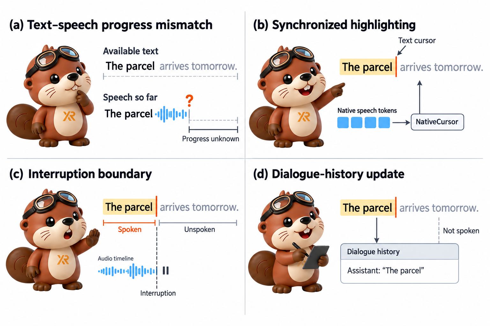

<div align="center">
  <h1>
    
    X2Streaming-TTS
  </h1>
  <p>
    <strong>面向流式文本的因果 token 级语音合成</strong><br>
    大模型还在写，语音已经开口；说出去的每个字都算数。
  </p>
  <p>
    <a href="https://arxiv.org/abs/2608.18661"></a>
    <a href="https://arxiv.org/abs/2609.09677"></a>
    <a href="https://huggingface.co/x-square-robot/X2Streaming-TTS-1.7B"></a>
    <a href="https://huggingface.co/x-square-robot/X2-NativeCursor-Qwen3TTS-12Hz"></a>
    <a href="https://github.com/X-Square-Robot/X2Streaming-TTS/actions/workflows/ci.yml"></a>
    
    <a href="LICENSE"></a>
    <a href="https://github.com/X-Square-Robot/Qwen3TTS-Streaming"></a>
    <a href="https://github.com/X-Square-Robot/X2-Turn"></a>
  </p>
</div>

[English](README.md) | **简体中文**

<div align="center">
  
  <p><em>X2Streaming-TTS 与 X2-NativeCursor 的应用示意：文本逐步到达时开始发声，跨片段维持语音连续，按朗读进度同步高亮，结合播放时钟处理打断，并以已播放内容更新对话历史。</em></p>
</div>

X2Streaming-TTS 是论文 [*X2Streaming-TTS: Causal Token-Level Text-to-Speech from
Streaming Text with Speech-State Inheritance*](https://arxiv.org/abs/2608.18661)
的参考实现。论文提出两个机制：**因果承诺（causal commitment）** 决定哪些文本可以开始读、
一段话读到哪里收尾；**因果语音状态继承（causal speech-state inheritance）** 让下一段接着
上一段的嗓音继续说。

这项工作建立在 X Square Robot 自己的推理引擎工程
[Qwen3TTS-Streaming](https://github.com/X-Square-Robot/Qwen3TTS-Streaming) 之上。该引擎
把 Qwen3-TTS 的官方权重导出为 ONNX/TensorRT，并负责调度、连续批处理、协议、网关与
部署；本文档后面称它为"上游引擎"。X2Streaming-TTS 是跑在这个引擎之上的方法层：本仓库
存放方法代码和把方法接进引擎的 hook，引擎本身以固定版本的 git submodule 引用
（对应提交 `0745e4a8`）。

## 🔥 News

- **[2026-09-09] X2-NativeCursor 论文上线 arXiv。**
  [*X2-NativeCursor: Native-Token Text Progress Tracking for Incremental-Text Streaming Codec TTS*](https://arxiv.org/abs/2609.09677)
  已公开，BibTeX 见[引用](#引用)。
- **[2026-09-07] X2-NativeCursor：从生成器自己的 token 里读出朗读进度。**
  流式 TTS 在句子写完之前就开始说话，客户端收到音频时需要知道它对应原文的哪几个字。
  X2-NativeCursor 是一个约 2M 参数的小模型，读取 Talker 每 80 ms 输出的 codebook-0
  token，实时给出"现在读到原文第几个字"，位置始终向前。整个过程只增加这一个小模型，
  TTS 生成器、tokenizer 和声码器保持原样。它已随上游引擎发布，在配置里写
  `text_progress.estimator: native` 即可打开；见下文
  [X2-NativeCursor](#x2-nativecursor从原生-token-读出朗读进度) 与
  [功能页](docs/native_cursor.zh-CN.md)。
- **[2026-09-07] 权重开源。** 部署版 checkpoint
  [`x-square-robot/X2Streaming-TTS-1.7B`](https://huggingface.co/x-square-robot/X2Streaming-TTS-1.7B)
  与 X2-NativeCursor 观察器头
  [`x-square-robot/X2-NativeCursor-Qwen3TTS-12Hz`](https://huggingface.co/x-square-robot/X2-NativeCursor-Qwen3TTS-12Hz)
  发布到 Hugging Face，均为 Apache-2.0。见[模型与权重](#模型与权重)。
- **[2026-08-19]** 论文上线 arXiv：[2608.18661](https://arxiv.org/abs/2608.18661)。
- **[2026-08-06]** 方法代码首次公开，对应 Qwen3TTS-Streaming 提交 `0745e4a8`。

<div align="center">
  
  <p><em>X2-NativeCursor 接在真实引擎上的效果。每一步高亮、轨迹上的每一个点都来自引擎实时发出的 <code>text_progress</code> 进度事件。<code>23%</code> 读作"百分之二十三"，"百分之"先于数字读出，进度依然按书写顺序前进。带本次会话原声的完整片段：<a href="docs/assets/native_cursor_lab.mp4">native_cursor_lab.mp4</a>。</em></p>
</div>

## 模型与权重

| 仓库 | 内容 | 大小 | 许可 |
| --- | --- | --: | --- |
| [`x-square-robot/X2Streaming-TTS-1.7B`](https://huggingface.co/x-square-robot/X2Streaming-TTS-1.7B) | 由 Qwen3-TTS-12Hz-1.7B-Base 微调的 CustomVoice 模型，音色 `robot_service_v1`，Hugging Face 格式（safetensors + 12 Hz 语音 tokenizer），可直接交给上游引擎导出 TensorRT | 4.3 GB | Apache-2.0 |
| [`x-square-robot/X2-NativeCursor-Qwen3TTS-12Hz`](https://huggingface.co/x-square-robot/X2-NativeCursor-Qwen3TTS-12Hz) | 朗读进度观察器头，2.0M 参数，读取上述模型的 codebook-0 token；放入引擎的 `resources/native_cursor/` 即可启用 | 8.2 MB | Apache-2.0 |

两个仓库的 model card 各自写明了文件清单、SHA-256、用法与适用范围。

## 目录

- [token 级流式为什么难](#token-级流式为什么难)
- [X2Streaming-TTS 做了什么](#x2streaming-tts-做了什么)
- [实验结果](#实验结果)
- [X2-NativeCursor：从原生 token 读出朗读进度](#x2-nativecursor从原生-token-读出朗读进度)
- [Demo](#demo)
- [快速开始](#快速开始)
- [仓库布局](#仓库布局)
- [状态与限制](#状态与限制)
- [相关项目](#相关项目)
- [引用](#引用)
- [致谢](#致谢)
- [许可](#许可)
- [Star History](#star-history)

## token 级流式为什么难

语音一旦播出去就定型了。上游大模型写到 `He finished 3` 时，下一个 token 才决定 `3`
读 *three*（`3 laps`）还是 *third*（`3rd`）；说出 *three* 之后，这个读法就定了。多数
"流式"TTS 靠等完整句子来回避这个问题，所以只能算伪流式：第一声什么时候出来，取决于
大模型什么时候把整句写完。

真正的 token 级合成，必须**在只看到一部分文本时就做出最终决定**。三件离线合成时理所
当然的事，在这里都变难了：

| 要求 | 直接逐 token 合成会遇到什么 |
| --- | --- |
| **读音** | 数字、单位、符号的读法要靠后面的字才能确定，而它们已经先被读出去了。 |
| **换气** | 只按标点切，会切出很多很短的片段，模型反复启停，白白消耗每段有限的生成长度；按固定长度切，又会切在和语句结构无关的地方。 |
| **接续** | 每段都从静音重新起步，音高和音色要重新建立，段与段之间的接缝听得出来。 |

<div align="center">
  
  <p><em>论文图 1。左：前端只把已经确定读法的文本交给模型（等待期间输出 PAD），Talker 输出声学 token，Code2Wav 边解码边播放。右：三个挑战及各自对应的机制。</em></p>
</div>

## X2Streaming-TTS 做了什么

系统一边接收逐个到达的文本 token，一边只依据已经到达的文本输出语音。这样做行得通，
是因为读出一个字所花的时间，通常比大模型写出下一个字的时间长得多：把已经到达的文本
读出来，后面的字自然就到了。两个机制保证这样做是安全的。

### 因果承诺：决定什么可以读、一段读到哪里收尾

- **先确认读法，再开口。** 只要后面的字还可能改变一个表达的读法，这个表达就先保留；
  `He finished 3` 里的 `3` 先等，等到 `3rd` 或 `3 laps` 出现，整个表达一次性转成读音并
  交给模型，此后固定。
- **按剩余容量和标点决定在哪里断句。** 模型一段能连续生成的长度有限。方法在线估计
  每个字大约要占多少生成步，在额度用完之前收尾；标点按强弱分档（句末、分句、弱标点），
  优先在强标点处断，直到额度将尽才退而硬切。论文证明了这样做最多会多切出多少段。

### 因果语音状态继承：跨过断点，把嗓音接下去

- **波形解码接着上一段算。** 上一段完整的 Code2Wav 状态（KV cache、卷积状态、帧索引）
  直接交给下一段，下一段的波形从这里继续。
- **只带有限的历史。** 上一段最后 `H = 4` 个 Talker 状态传给下一段作为上下文。传递方式
  是一个固定的注意力先验：它只覆盖过去位置，注入的残差大小有明确上限，因果性得以保持，
  上一段的影响也被限制在合理范围内。
- **先体检，再继承。** 上一段正常结束时才继承状态，其他情况下下一段从默认状态重新开始。

<div align="center">
  
  <p><em>论文图 2。上一段通过健康检查后，它的 Code2Wav 状态直接接给下一段，最后几个 Talker 状态经因果先验注意力与门控残差提供有限的上下文。</em></p>
</div>

### 亮点

- **严格因果。** 每个声学 token 只依赖它生成之前已经看到的文本、之前生成的声学 token
  和从上一段继承的状态。
- **质量和离线合成相当。** 用同一份权重做离线合成作参考，8 个测试条件里有 3 个比离线
  还好，其余最多差 0.62 个百分点。
- **接缝更平滑。** 段与段交界处的音高跳变降到 22.61 Hz，最好的 chunk 级对比系统是
  31.68 Hz。
- **符号读得对。** 符号密集的文本上字错误率 2.00%、读法完全正确的比例 73.3%，最强的
  对比系统是 6.65% 与 40.0%。
- **首包快。** 单路请求首个音频 token 的中位时延 15.8 ms，128 路并发 260.8 ms（单张
  RTX 5090）。
- **建立在开源引擎之上。** 一切跑在 Qwen3TTS-Streaming 上，TensorRT 导出、连续批处理、
  网关和 SDK 直接继承。

## 实验结果

以下数字均来自[论文](https://arxiv.org/abs/2608.18661)，使用 `config.py` 中的默认值。
为了评测可控，文本 token 以固定速率送入；实际部署中大模型出词的节奏会更不均匀。

**识别准确率与长文本稳定性**（错误率 %，越低越好）。首行和末行是同一个模型、同一份
权重，一个离线合成、一个逐 token 流式合成，两行的差距就是流式输入付出的代价。

| 模型 | 流式 | 粒度 | SEED zh CER | SEED en WER | MiniMax zh CER | MiniMax en WER | 长文 1× | 长文 2× | 长文 5× | 长文 10× |
| --- | :-: | :-: | --: | --: | --: | --: | --: | --: | --: | --: |
| Qwen3-TTS-12Hz-1.7B | ✗ | 离线 | 1.10 | 1.43 | 0.87 | 1.85 | 3.95 | 3.05 | 4.01 | 3.93 |
| F5-TTS | ✗ | 离线 | 1.52 | 2.00 | 3.74 | 2.08 | 4.42 | 3.81 | 5.04 | 4.95 |
| FireRedTTS-2 | ✓ | chunk | 1.14 | 1.95 | 0.97 | 2.25 | 5.36 | 4.79 | 5.04 | 5.32 |
| CosyVoice 2-S | ✓ | chunk | 1.45 | 2.57 | 1.98 | 2.38 | 4.76 | 3.83 | 5.05 | 5.48 |
| CosyVoice 3-S | ✓ | chunk | 0.81 | **1.68** | 1.43 | 2.21 | 4.72 | **3.36** | 4.86 | 5.12 |
| **X2Streaming-TTS** | ✓ | **token** | **0.78** | 1.93 | **0.78** | **1.86** | **2.55** | 3.67 | **4.08** | **4.36** |

**接缝质量与长文本稳定性**（文本 token 以固定速率到达；59 段文本、954 个所有系统共同
的断点；音色相似度与 UTMOS 在固定的 10 秒窗口上计算）。ΔF0、ΔE 是断点两侧的音高和
能量跳变，PBD 是断点不连续度，三者越低越好；ECAPA 是音色相似度，UTMOS 是自动打出的
听感分，越高越好。

| 系统 | ΔF0 (Hz) ↓ | ΔE (dB) ↓ | PBD ↓ | ECAPA 音色相似度 ↑ | UTMOS ↑ |
| --- | --: | --: | --: | --: | --: |
| CosyVoice 2-S | 46.89 | 3.39 | 0.3427 | 0.9304 | 3.1949 |
| CosyVoice 3-S | 47.53 | 3.41 | 0.3479 | 0.9264 | 2.6899 |
| FireRedTTS-2 | 31.68 | 2.17 | 0.1915 | 0.5205 | 3.2704 |
| **X2Streaming-TTS** | **22.61** | **1.66** | **0.1092** | **0.9511** | **3.9200** |

**数字与符号的读法**（所有系统输入完全相同；120 名听众打分。*Read* = 读法完全正确的
比例，*Sem.* = 听众认为意思正确的比例）。

| 系统 | CER ↓ | Read ↑ | UTMOS ↑ | MOS ↑ | Sem. ↑ |
| --- | --: | --: | --: | --: | --: |
| CosyVoice 2-S | 33.41 | 0.0 | 3.075 | 3.220 | 0.00 |
| CosyVoice 3-S | 6.65 | 40.0 | 3.017 | 3.183 | 60.00 |
| FireRedTTS-2 | 18.21 | 13.3 | 2.788 | 3.629 | 6.67 |
| **X2Streaming-TTS** | **2.00** | **73.3** | **4.025** | **3.802** | **93.33** |

**断句策略**在 59 段留出文本上：每段生成额度的利用率从只按标点切的 11.77% 提高到
76.93%；被迫硬切的比例从固定窗口的 87.13% 降到 0.54%；断句位置与人工标注的一致性
F1 达 0.952，略高于能预读 48 个未来子词的文本切分器 SaT-3L（0.940）。

<div align="center">
  
  <p><em>单张 RTX 5090、已部署的 BF16 引擎，不同并发下首个音频 token 的时延。点为客户端中位数，阴影覆盖最小值到第 99 百分位；每档先预热 3 轮，再测 20 轮。</em></p>
</div>

## X2-NativeCursor：从原生 token 读出朗读进度

论文：[*X2-NativeCursor: Native-Token Text Progress Tracking for Incremental-Text Streaming Codec TTS*](https://arxiv.org/abs/2609.09677)。

token 级流式一旦跑通，第二个问题立刻出现：**刚收到的这段音频，读的是原文的哪几个字？**
随读高亮、用户打断时结算听到了多少、字幕时间轴、对话历史，都需要这个位置。"每个字
固定多少帧音频"只是粗略估算；跑一个语音对齐模型可以拿到准确位置，但每一路都要多付
一个声学模型的开销。

X2-NativeCursor 在**波形解码之前**就给出答案。Talker 每 80 ms 输出一个 codebook-0
token；一个轻量的观察器读取它，和目前已到达文本的读音逐个比对，估计现在读到了哪里。
对外发布的位置只取到目前为止到达过的最远处，再换算回原文的字数，所以即使读音顺序和
书写顺序不同（`99%` 读作"百分之九十九"），位置也始终向前。生成器、tokenizer 和声码器
保持原样。

<div align="center">
  
  <p><em>总览。(1) TNPlan 把每个读音标签对应到原文的哪几个字。(2) 原生 token 编码器与 (3) 局部匹配器在波形解码之前跟踪当前读到的位置。虚线路径只在训练时使用。</em></p>
</div>

| | 研究评测 | 引擎验收 |
| --- | --- | --- |
| 设置 | Qwen3-TTS，800 条固定测试文本，文本按 2–8 字分块送入，参考 = Qwen3-ForcedAligner | 上游引擎自己合成的 80 条留出语句，实时 `text_progress` 事件，同一参考 |
| 位置误差 | 平均 **0.151** 个汉字（在线波形对齐基线 1.253，而且它需要 4 倍的前瞻） | 平均 **0.215** 个原文字符（95% 置信区间 0.166–0.280） |
| 字起点命中率 F1（容差 80 ms） | 0.924 | 0.928 |
| 需要提前看的音频（前瞻） | 80 ms（一个原生帧） | 80 ms |
| 计算开销 | 实时率 0.0180（计算时间 / 音频时长），波形基线 0.3598 | 每帧 p50 4.2 / 6.6 / 13.6 ms（1 / 4 / 16 路并发，CPU） |
| 单调性 | 发布的位置始终向前 | 6,441 个进度事件全部向前 |

观察器可以为其他基于离散语音 token 的 TTS 重新训练；在 CosyVoice2 上用同一结构得到
平均 0.284 个汉字的误差。发布的观察器头在
[`x-square-robot/X2-NativeCursor-Qwen3TTS-12Hz`](https://huggingface.co/x-square-robot/X2-NativeCursor-Qwen3TTS-12Hz)，
它已作为参考集成进入上游引擎（`dev` 分支）：

```yaml
# Qwen3TTS-Streaming 的 engine.yaml
text_progress:
  estimator: native                      # ema（默认）| native
  native_head_path: resources/native_cursor/qwen3_tts_12hz_la1_seed0.pt
```

进度沿用现有的 `text_progress` 事件下发，事件里带 `progress_basis=native_cursor_v1`，
现有客户端直接可用。细节与事件格式见[功能页](docs/native_cursor.zh-CN.md)；设计文档与代码在
上游引擎的
[`docs/dev/design/native_cursor_progress.zh-CN.md`](https://github.com/X-Square-Robot/Qwen3TTS-Streaming/blob/dev/docs/dev/design/native_cursor_progress.zh-CN.md)
与 [`engine/core/native_cursor/`](https://github.com/X-Square-Robot/Qwen3TTS-Streaming/tree/dev/engine/core/native_cursor)。

## Demo

上游引擎自带浏览器门户 `/demo/`，包含文本播放器、LLM PK 实验台和并发实验台。以下录屏
都是对着真实引擎录制的，屏幕上的数字都是实时结果。

<table>
  <tr>
    <td align="center" width="50%">
      
      <br><sub><b>文本播放器。</b>播放进度和引擎的解码步同步，哪一步在读字、哪一步在冲刷尾音，都实时可见。</sub>
    </td>
    <td align="center" width="50%">
      
      <br><sub><b>LLM PK。</b>按选定速率模拟上游大模型出词：token 级 TTS 先开口，离线 TTS 还在等最后一个字。</sub>
    </td>
  </tr>
  <tr>
    <td align="center" colspan="2">
      
      <br><sub><b>多路合成。</b>128 路并发会话及各自的首包时延分布；点任意一路可听真实音频。</sub>
    </td>
  </tr>
</table>

要运行门户，先部署上游引擎，再打开实例上的 `/demo/`；见上游引擎的
[部署指南](https://github.com/X-Square-Robot/Qwen3TTS-Streaming/blob/main/docs/user/deployment.zh-CN.md)。
[News](#-news) 里的 X2-NativeCursor 实验台是上游引擎的
[`tools/validation/native_cursor_demo.py --serve 8800`](https://github.com/X-Square-Robot/Qwen3TTS-Streaming/blob/dev/tools/validation/native_cursor_demo.py)。

## 快速开始

### 安装与校验

```bash
git clone --recursive https://github.com/X-Square-Robot/X2Streaming-TTS.git
cd X2Streaming-TTS
python scripts/verify_upstream.py        # 检查 submodule 与 UPSTREAM_LOCK.json 一致
python -m pip install -e ".[test]"
pytest -q                                # 方法、兼容性与来源校验测试
```

如果克隆时省略了 `--recursive`：

```bash
git submodule update --init --recursive
```

可选依赖：`.[tn]` 安装论文所用中文文本正则化器依赖的 WeTextProcessing；`.[torch]`
是语音状态继承所需。

### 下载权重

```bash
pip install -U "huggingface_hub[cli]"
huggingface-cli download x-square-robot/X2Streaming-TTS-1.7B \
  --local-dir ./weights/X2Streaming-TTS-1.7B
huggingface-cli download x-square-robot/X2-NativeCursor-Qwen3TTS-12Hz \
  --local-dir ./weights/X2-NativeCursor-Qwen3TTS-12Hz
```

第一个目录可直接作为上游引擎 `custom-1.7b` 变体的权重来源；第二个目录里的
`qwen3_tts_12hz_la1_seed0.pt` 放到引擎的 `resources/native_cursor/` 下即可启用进度
观察器。两个 model card 各自给出了完整用法。

### 应用上游引擎的 hook

方法通过两个很小的补丁接进引擎。把补丁打到一个临时 worktree 上，submodule 保持原样，
来源校验的结果才稳定：

```bash
python scripts/verify_upstream.py
python scripts/verify_patches.py
hook_tree="$(mktemp -d)/Qwen3TTS-Streaming"
git -C third_party/Qwen3TTS-Streaming worktree add --detach "$hook_tree" \
  0745e4a8613f0780cc57475452ee775a9abac2dd
for patch in "$PWD"/patches/upstream/0745e4a8613f0780cc57475452ee775a9abac2dd/*.patch; do
  git -C "$hook_tree" apply "$patch"
done
```

第一个补丁管理每个会话的策略对象：谁创建、何时失效。第二个补丁把方法接进引擎：
文本何时交给模型、解码过程的观测、通过健康检查后再收尾片段、保存 Code2Wav 快照、
下一段恢复状态，以及文本—声学桥。策略代码一旦抛异常，引擎就退回原有逻辑继续服务。

### 使用策略对象

按会话构造策略对象，全部通过接口完成，上游引擎的代码保持独立：

```python
from x2streaming_tts import X2StreamingPolicy
from x2streaming_tts.adapters.qwen3tts_streaming import build_policy_factories
from x2streaming_tts.commitment.text_normalizer import (
    get_wetext_chinese_normalizer,
)

policy = X2StreamingPolicy(text_normalizer=get_wetext_chinese_normalizer())
extensions = build_policy_factories(policy).to_upstream()
# 将 extensions=extensions 传给打过补丁的上游 TTSEngine 构造函数。
```

`X2StreamingPolicy` 只包含论文报告的两个机制；研发过程中尝试过的其他方案
（profile 选择器、QK 一致性注意力轨迹、Talker KV-cache 直接搬运、音频边界裁剪）已从
公开代码中移除。

### 对着真实 checkpoint 跑

先在打过补丁的 worktree 里用上游引擎的流水线编译 TensorRT 引擎。`custom-1.7b` 变体
从 `workspace/models/Qwen3-TTS-12Hz-1.7B-CustomVoice` 读取权重，把上面下载的目录软链接
到这个位置，并跳过官方权重下载：

```bash
ln -s "$PWD/weights/X2Streaming-TTS-1.7B" "$hook_tree/workspace/models/Qwen3-TTS-12Hz-1.7B-CustomVoice"
(cd "$hook_tree" && SKIP_MODELS=1 bash scripts/bash/autorun.sh all -m custom-1.7b)
```

然后向打过补丁的引擎发一条请求：

```bash
python scripts/run_checkpoint_e2e.py \
  --upstream-root "$hook_tree" \
  --engine-dir <path-to-model.plan-dir> \
  --weights-dir ./weights/X2Streaming-TTS-1.7B \
  --tokenizer-dir ./weights/X2Streaming-TTS-1.7B
```

`scripts/stress_x2streaming_cuda.py` 连续跑数千个片段，检验状态继承长期运行的稳定性；
`scripts/benchmark_bridge_cuda.py` 在每张可见 GPU 上单独测文本—声学桥的耗时。

## 仓库布局

```text
X2Streaming-TTS/
├── src/x2streaming_tts/              # 方法本身
│   ├── commitment/                   #   因果承诺：读法确认、正则化、容量估计
│   ├── inheritance/                  #   因果语音状态继承与文本—声学桥
│   ├── adapters/qwen3tts_streaming/  #   上游引擎 hook 调用的接口与工厂
│   ├── config.py                     #   论文默认值
│   └── policy.py                     #   X2StreamingPolicy 入口
├── patches/upstream/<sha>/           # 针对固定上游提交的最小 hook 补丁
├── third_party/Qwen3TTS-Streaming/   # 固定版本的上游引擎（git submodule）
├── scripts/                          # verify_upstream / verify_patches / e2e / stress / benchmark
├── tests/                            # 方法、兼容性、GPU 与来源校验测试
├── docs/                             # 功能页与 README 媒体
├── CITATION.cff · CONTRIBUTIONS.md · THIRD_PARTY.md · UPSTREAM_LOCK.json · PROVENANCE.json
└── CHANGELOG.md
```

归属与许可边界见 [CONTRIBUTIONS.md](CONTRIBUTIONS.md) 与
[THIRD_PARTY.md](THIRD_PARTY.md)，每个抽取文件的来源见 [PROVENANCE.json](PROVENANCE.json)，
上游引擎集成规则见 [patches/README.md](patches/README.md)。

## 状态与限制

- **预发布。** 代码抽取与两个补丁构成的 hook 序列均已实现，并已在 RTX 4090 D 上用真实的
  `custom-1.7b` TensorRT checkpoint 跑通。在第一个 release candidate 之前，更广泛的
  故障注入、并发与长流测试仍在进行中。
- **上游引擎的固定版本。** 补丁对应上游引擎提交 `0745e4a8`。要用在更新的提交上（包括
  带 X2-NativeCursor 的 `dev` 分支），补丁需要重新适配；同样的通用 hook 正在提交给上游
  引擎，合入后这些补丁就可以去掉。
- **继承引擎的注意事项。** 流式幻觉、重复与漏读强依赖 checkpoint，见上游引擎的
  [已知限制](https://github.com/X-Square-Robot/Qwen3TTS-Streaming/blob/main/docs/user/known_limitations.zh-CN.md)。
- **数字有条件。** 时延数字取决于论文所述的 GPU、精度、并发与测量窗口，请结合条件解读。
- **权重在 Hugging Face。** 本仓库只包含代码与文档媒体；发布的 checkpoint 与观察器头
  见[模型与权重](#模型与权重)，数据集、实验结果、生成音频与 TensorRT 产物均在仓库之外
  管理。

## 相关项目

X2Streaming-TTS 是 X Square Robot 开源语音对话栈的一部分。各组件按设计协同工作：
X2-Turn 判断用户何时说完，大模型逐 token 回复，X2Streaming-TTS 在回复还在生成时就把它
说出来。

| 项目 | 做什么 | 论文 |
| --- | --- | --- |
| [**X2-Turn**](https://github.com/X-Square-Robot/X2-Turn) | 帧同步的流式语音识别，带轮次状态头，每 80 ms 判断一次 `idle` / `speaking` / `turn_end` / `backchannel`；附带以 Qwen3TTS-Streaming 为 TTS 的全双工对话 demo | [arXiv:2608.10878](https://arxiv.org/abs/2608.10878) |
| [**Qwen3TTS-Streaming**](https://github.com/X-Square-Robot/Qwen3TTS-Streaming) | X Square Robot 的流式 TTS 推理引擎：把 Qwen3-TTS 导出为 ONNX/TensorRT，提供连续批处理、prefix cache、原生 WebSocket / OpenAI Realtime 网关，以及 Python 与浏览器 SDK；本仓库的方法就跑在它上面 | — |
| **X2Streaming-TTS**（本仓库） | 引擎之上的因果承诺与因果语音状态继承，以及 X2-NativeCursor 进度跟踪 | [X2Streaming-TTS](https://arxiv.org/abs/2608.18661)、[X2-NativeCursor](https://arxiv.org/abs/2609.09677) |

## 引用

如果 X2Streaming-TTS 对你的研究有帮助，请引用论文与上游引擎：

```bibtex
@article{wen2026x2streamingtts,
  title   = {X2Streaming-TTS: Causal Token-Level Text-to-Speech from Streaming Text with Speech-State Inheritance},
  author  = {Wen, Rime and Liu, Zehan and Qin, Shawn and Shi, Lights and Gan, Roy and Wang, Hao and Wang, Qian},
  journal = {arXiv preprint arXiv:2608.18661},
  year    = {2026},
}
```

如果使用 X2-NativeCursor 进行文本进度跟踪，请同时引用：

```bibtex
@article{liu2026x2nativecursor,
  title   = {X2-NativeCursor: Native-Token Text Progress Tracking for Incremental-Text Streaming Codec TTS},
  author  = {Liu, Zehan and Chen, Carl and Wen, Rime and Fu, Kaiqi and Lin, Altman and Qin, Shawn and Shi, Lights and Gan, Roy and Wang, Hao and Wang, Qian},
  journal = {arXiv preprint arXiv:2609.09677},
  year    = {2026},
  url     = {https://arxiv.org/abs/2609.09677},
}
```

X2Streaming-TTS 的机器可读引用记录见 [CITATION.cff](CITATION.cff)。

## 致谢

X2Streaming-TTS 建立在开源语音社区的模型、引擎与工具之上。感谢：

- [Qwen3-TTS](https://github.com/QwenLM/Qwen3-TTS)（阿里云 / Qwen 团队）：它的声学
  token 数量可计、Code2Wav 状态可以在片段之间传递、cache 容量可以读取，严格因果的实现
  依赖这三点。
- [Qwen3TTS-Streaming](https://github.com/X-Square-Robot/Qwen3TTS-Streaming)：本方法所
  运行的 TensorRT 导出、调度器、网关与 SDK。
- [X2-Turn](https://github.com/X-Square-Robot/X2-Turn)：其全双工对话 demo 端到端地
  检验了引擎。
- [WeTextProcessing](https://github.com/wenet-e2e/WeTextProcessing)：发布的正则化器所用
  的中文文本正则化。
- [Qwen3-ForcedAligner](https://github.com/QwenLM/Qwen3-ASR) 与
  [CosyVoice2](https://github.com/FunAudioLLM/CosyVoice)：X2-NativeCursor 研究中的对齐
  参考与第二个 TTS 骨干。
- NVIDIA TensorRT 与 Triton Inference Server：上游引擎的部署基础。

## 许可

X2Streaming-TTS 代码以 [MIT 许可](LICENSE)发布，Copyright (c) 2026 XSquareRobot。
发布的模型权重为 Apache-2.0；固定版本的上游引擎为 MIT；Qwen3-TTS 为 Apache 2.0；
NVIDIA 运行时镜像与可选的 TEN VAD 依赖各自保留其条款。见 [THIRD_PARTY.md](THIRD_PARTY.md)
与 [NOTICE](NOTICE)。

## Star History

[](https://www.star-history.com/?repos=X-Square-Robot%2FX2Streaming-TTS&type=date&legend=top-left)
