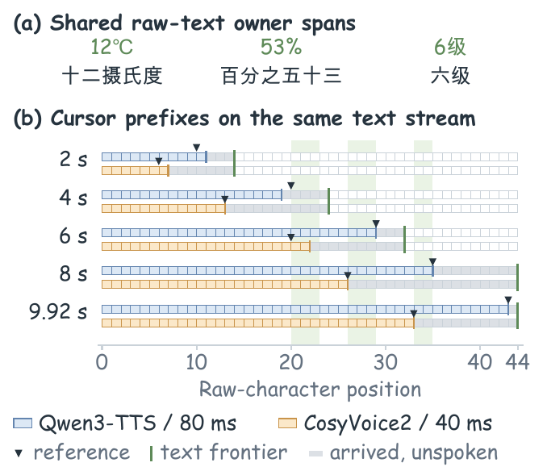
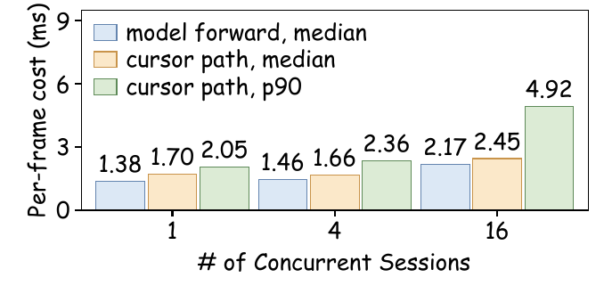

[English](native_cursor.md) | **简体中文**

# X2-NativeCursor：从原生 token 读出朗读进度

> 状态：已作为参考集成随上游 Qwen3TTS-Streaming 引擎（`dev` 分支）发布；发布的观察器头在
> [`zehan1/X2-NativeCursor-Qwen3TTS-12Hz`](https://huggingface.co/zehan1/X2-NativeCursor-Qwen3TTS-12Hz)。
> 论文评审中。本仓库的 hook 补丁对应上游引擎提交 `0745e4a8`，早于观察器的加入。

## 问题

token 级流式 TTS 在句子写完之前就开始说话。客户端收到音频块时，并不知道它们对应原文
的哪几个字。任何需要这个位置的功能，比如随读随高亮、用户打断时结算实际听到的内容、
字幕时间轴、更新对话历史，都得自己把它重建出来。

两个显而易见的答案各有短板。"每个 token 固定多少帧音频"只是粗略估算：它在句内
漂移，读音顺序与书写顺序不同时就失效（`23%` 读作"百分之二十三"，百分号在前）。
波形对齐器能从音频里恢复位置，但每路流都要多一个声学模型，增加前瞻，而且只能在声码器
产出采样之后才开始。

## 思路

codec 类 TTS 在把语音解码成波形之前，先产生离散的语音 token。这些 token 本身已携带
内容与时间信息。X2-NativeCursor 直接读它们：

1. **TNPlan** 把目前已承诺的文本转成*读音标签*（正则化后的读法），并记录每个标签归属
   原文的哪个区间。`99%` 的所有标签共享 `99%` 这个区间，所以即使读音顺序和书写顺序
   不同，投影回原文也是精确的。标签只在读法不可能再改变时才释放。
2. **原生 token 编码器**用一小叠膨胀卷积和一帧前瞻，对 Talker 输出的每个 codebook-0
   token（Qwen3-TTS 上每 80 ms 一个）做嵌入。
3. **局部匹配器**把上一位置附近的标签（偏移 −2 到 +4）与当前 token 特征和一个小的
   位置状态（小数位置、停留时间、近期推进量）打分，再按期望偏移移动一个连续的内部
   位置。内部估计允许后退或跳过标签。
4. **发布游标**取内部位置的历史最高水位，映射到已到达的最远原文区间末端。它由构造
   保证单调。

只训练观察器（约 2M 参数），监督来自 Qwen3-ForcedAligner 的起点时间。TTS 生成器、
语音 tokenizer 与波形解码器保持原样，因此可以直接加到现有部署上，引擎照常使用已导出的产物。

<div align="center">
  
</div>

## 效果

**研究评测**（Qwen3-TTS；800 条留出文本，分四组各 200 条：纯中文、含数字中文、含符号
中文、英文；文本按 2–8 字分块送入；参考 = Qwen3-ForcedAligner；三个随机种子）：

| 方法 | 在线 | 前瞻 | 参数量 | MAE zh（字）↓ | MAE en ↓ | 起点 F1@80 ms ↑ |
| --- | :-: | --: | --: | --: | --: | --: |
| MMS-FA（完整音频） | ✗ | ∞ | 315.5 M | 0.539 | 1.610 | 0.430 |
| CTC-segmentation（完整音频） | ✗ | ∞ | 315.5 M | 0.371 | – | 0.418 |
| WindowMMS+PersistentCTC（在线波形） | ✓ | 320 ms | 315.5 M | 1.253 | 2.226 | 0.341 |
| Cross-attention readout（原生 token） | ✗ | 320 ms | 2.490 M | 0.414 | 1.629 | 0.828 |
| CodecCTC+skip-DP（原生 token） | ✓ | 320 ms | 1.705 M | 0.416 | 1.568 | 0.823 |
| **X2-NativeCursor** | ✓ | **80 ms** | 2.166 M | **0.151 ± 0.005** | **1.247** | **0.924** |

实时率从 0.3598（在线波形基线）降到 0.0180。以 MMS-FA 作为独立的第二参考时，中文
MAE 为 0.206，排序不变。在 CosyVoice2 的 token 上重训观察器，同一结构得到 0.284 的
中文 MAE。

<div align="center">
  
  <p><em>同一句话、同一文本到达节奏，在 Qwen3-TTS（80 ms 帧）与 CosyVoice2（40 ms 帧）上的游标。每条游标都在各自参考的两字以内，并且始终落在已到达的文本范围内。</em></p>
</div>

**引擎验收**（上游引擎自己合成的 80 条留出语句，实时 `text_progress` 锚点，同一参考）：

| 指标 | 数值 |
| --- | --- |
| 原文字符 MAE | 0.215（95% CI 0.166–0.280） |
| 起点 F1 @ 80 ms | 0.928 |
| 后退步数 | 6,441 个锚点中为 0 |
| 观察器每帧开销 p50（1 / 4 / 16 路，CPU） | 4.2 / 6.6 / 13.6 ms |
| 观察器每帧开销 p90（1 / 4 / 16 路，CPU） | 5.5 / 8.5 / 17.4 ms |

一个原生帧对应 80 ms 语音，这些并发档位下观察器都远在预算之内。

<div align="center">
  
  <p><em>单张 A800 上的独立计时：模型前向中位数，以及一次完整游标更新的中位数 / p90。</em></p>
</div>

## 实时演示

<div align="center">
  
</div>

录屏是上游的实验台页面
（[`tools/validation/native_cursor_demo.py --serve 8800`](https://github.com/X-Square-Robot/Qwen3TTS-Streaming/blob/dev/tools/validation/native_cursor_demo.py)）
通过原生 WebSocket 对着真实引擎运行。每一步高亮、轨迹上的每一个点都是真实的
`text_progress` 锚点。带本次会话原声的完整片段：
[`assets/native_cursor_lab.mp4`](assets/native_cursor_lab.mp4)。

## 在引擎中启用

下载观察器头，放到引擎的 `resources/native_cursor/` 下：

```bash
huggingface-cli download zehan1/X2-NativeCursor-Qwen3TTS-12Hz \
  --local-dir ./weights/X2-NativeCursor-Qwen3TTS-12Hz
cp ./weights/X2-NativeCursor-Qwen3TTS-12Hz/qwen3_tts_12hz_la1_seed0.pt \
   <Qwen3TTS-Streaming>/resources/native_cursor/
```

然后切换估计器：

```yaml
# engine.yaml
text_progress:
  estimator: native                      # ema（默认）| native
  native_head_path: resources/native_cursor/qwen3_tts_12hz_la1_seed0.pt
  native_device: auto                    # auto（= cpu）| cpu | cuda | cuda:N
```

也可以用环境变量打开：`ENGINE_TEXT_PROGRESS_ESTIMATOR=native`。观察器运行在前端线程；
`auto` 解析为 CPU，因为引擎线程全局捕获 CUDA graph，另一个线程上的第二个 CUDA 上下文
会使其失效。

锚点沿用现有的 `text_progress` 事件，现有客户端直接可用。每个锚点带
`progress_basis = native_cursor_v1` 与 `progress_quality = aligned`；头未加载或会话
尚无原生 token 时，内置的 `ema` 估计器仍作为回退。

设计文档、线协议与 golden 测试都在上游：

- [`docs/dev/design/native_cursor_progress.zh-CN.md`](https://github.com/X-Square-Robot/Qwen3TTS-Streaming/blob/dev/docs/dev/design/native_cursor_progress.zh-CN.md)
- [`engine/core/native_cursor/`](https://github.com/X-Square-Robot/Qwen3TTS-Streaming/tree/dev/engine/core/native_cursor)
- [`tests/unit/engine_core/test_native_cursor.py`](https://github.com/X-Square-Robot/Qwen3TTS-Streaming/blob/dev/tests/unit/engine_core/test_native_cursor.py)

## 与本仓库的关系

X2-NativeCursor 是论文方法的配套模块。因果承诺决定*什么*可以说、片段
*何时*收尾；语音状态继承决定下一片段*怎么*接上；X2-NativeCursor 报告音频此刻在原文的
*哪里*。它复用因果承诺产出的同一套 TNPlan 归属区间，所以游标在正则化表达上也能精确。

本仓库的 hook 补丁对应上游引擎提交 `0745e4a8`，早于观察器的加入。要让两套机制同时运行，
需要把补丁序列变基到 `dev` 分支；这项工作列入下一版本计划。
